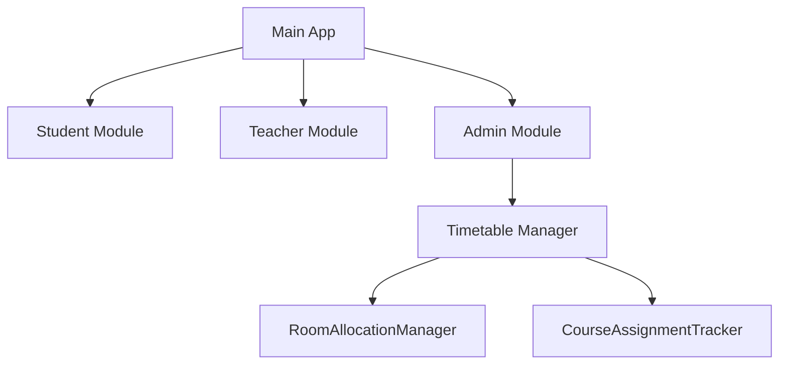

# FAST-NUCES Timetable Application

A complete Java Swing-based Timetable Management System designed for FAST NUCES. This system provides role-based access and real-time timetable scheduling for students, teachers, and administrators, enabling personalized timetable viewing and administrative control over schedule creation and updates.

## Overview

This robust desktop application streamlines academic scheduling while intelligently managing classroom and instructor conflicts through a thoughtfully designed, user-centric interface. Built on solid object-oriented principles and a modular architecture, it ensures scalability, maintainability, and reliable data persistence — making it a future-ready solution for institutional timetable management.

## Key Features

### 1 🔐 Role-Based Access
- **Student View**  
  - Enter Roll No., Department, and Section.  
  - Get a personalized timetable including classroom, timings, and course info.  
- **Teacher View**  
  - Enter name.  
  - See all assigned batches, courses, rooms, and timings consolidated in one table.  
- **Administrator View**  
  - Password protected (`admin123`).  
  - Full dashboard to create, view, update, and delete student/teacher timetables.  

### 2 🗓️ Timetable Management
- Auto-timetable generation based on batch, department, and section.  
- Dynamic timetable rendering with real-time view updates.  
- Manual overrides for personalized updates and edits.  

### 3 ⚖️ Conflict Resolution
- 🚫 No duplicate room booking: Uses `RoomAllocationManager`.  
- 🚫 No double teacher assignment: Uses `CourseAssignmentTracker`.  
- ✅ Checks applied before assigning courses or saving files.  

### 4 💾 Data Persistence
- `.txt` files for timetables (human-readable, editable).  
- `.dat` files for tracking room usage and course-to-teacher assignments.  
- JSON-like structures for department/section management.  

### 5 🎨 Advanced GUI Design
- Built fully in **Java Swing**.  
- **Visual Design:** Gradients, cloud-shaped elements, and pixel-perfect layouts with hover-animated buttons in a soft blue theme.  
- **Real-Time Updates:** File-based synchronization ensures immediate visibility of admin changes.  
- **Error Handling:** Robust input validation with intuitive error messages.  
- **Admin Control:** Toggle-enabled dashboard with bulk actions and conflict prevention.  

### 6 📃 Activity Log (Admin)
- Timetable Master — Full CRUD operations for schedules (*One-Click Editor*).  
- Batch Assign Pro — Assign multiple courses to teachers in one go (*Bulk Scheduler*).  
- Safe Mode — Overwrite confirmations and conflict alerts (*Conflict Detector*).  

### 7 🚆 Unified Intelligence
- Teacher Command Center — Consolidated timetable view across all classes (*Unified Schedule Builder*).  
- Admin Radar — Filter timetables by batch/department (*Smart Search Filters*).  
- Course Sentinel — Flags overlapping assignments for teachers (*Overlap Alert System*).  

## Architecture

### 🧱 Modules
- Student, Teacher, and Administrator roles with separate login and views.  
- Timetable: Manages weekly schedule data.  
- CourseAssignmentTracker: Tracks teacher-course assignments.  
- RoomAllocationManager: Manages and validates room availability.  

### 🧠 Design Patterns
| **Pattern**  | **Implementation Level** | **Code Evidence**                     |
|--------------|--------------------------|---------------------------------------|
| Singleton    | Partial                  | Main Application instance             |
| MVC          | Strong                   | Separation of GUI and logic           |
| Factory      | Clear                    | Role cards & `createStudentFromLogin()` |
| Observer     | Planned                  | File-based changes need manual refresh |
| Strategy     | Emerging                 | Polymorphic `displayTimetable()`      |
| Facade       | Present                  | JSON_FUNCTIONS (simplified API)       |

## 🖥️ How It Works

### Student Flow
1. Launch app → Select "Student".  
2. Enter Roll No., Department, Section.  
3. View timetable dynamically from file.  

### Teacher Flow
1. Launch app → Select "Teacher".  
2. Enter Name.  
3. View consolidated schedule across batches.  

### Admin Flow
1. Launch app → Select "Administrator".  
2. Login using password.  
3. Dashboard lets admin:  
   - Create/Update/Delete Student Timetable.  
   - Create/Update/Delete Teacher Timetable.  
   - View logs, manage conflicts, re-assign classes.
     

## 🧰 Requirements
- Java SE 8 or higher.  
- Works on Windows, Linux, macOS.  
- No external libraries or frameworks required.  

## 💡 Future Improvements
- 🔐 Biometric login (Fingerprint support for Admin).  
- 🗃️ Shift to MySQL/SQLite for large dataset handling.  
- 📤 Export timetables to PDF/CSV.  
- 🧪 Add unit tests for timetable validation logic.  
- ⚙️ Configurable paths for saving `.txt` and `.dat` files.  
- 🌐 Cloud sync support for cross-machine accessibility.  

## 📜 License
This system is intended for **educational and institutional use only**. Any reuse or deployment should credit the developers accordingly.  

## 🧑‍💻 Developed By
- **Afshal Liaquat**  
  Department of Software Engineering  
  FAST NUCES Karachi Campus  
